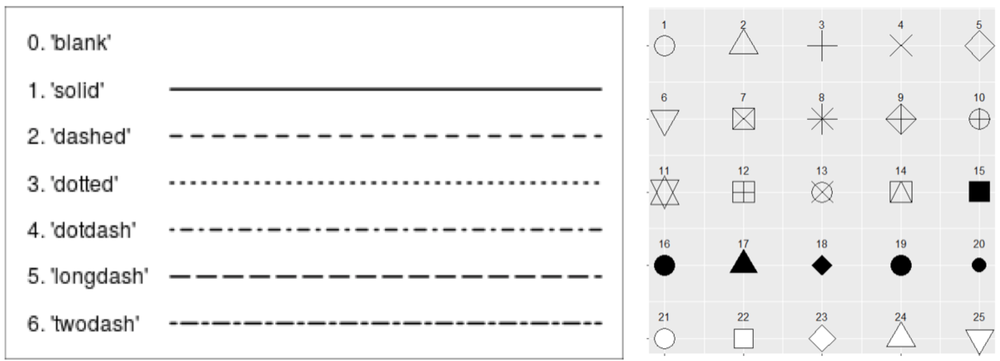

```{r setup, include=FALSE}
knitr::opts_chunk$set(echo = TRUE)
knitr::opts_chunk$set(dev='png', fig.align = 'center', fig.height = 4, fig.width = 6) 
library(tidyverse)

```

## Lesson Outcomes  
 - Create publication-quality graphics using the ggplot2 package.
 - Describe what types of customizations are possible with ggplot2.
 - Discuss ggplot2 syntax and components.
 - Save plots in different output formats.
 
## Data visualization with `ggplot2`

There are several functions available in base R for creating graphics, like `hist()` and `plot()`. There is also a graphics package, called `lattice`. The tidyverse has its own paradigm for creating graphics called ggplot. The advantage to using ggplot over base R functions is that the gpplot paradigm comes with many built in defaults to make your plots look nice without having to code too much customization. As we go through some examples, note how ggplot has automatically chosen color schemes, scales, and axis labels for us, without us specifying any of this. Of course, we can override these, but having some usable defaults built in makes it very fast to produce nice plots.

## Useful resources for `ggplot2`
For inspiration and for help creating graphics with `ggplot2`, bookmark these pages:  

* THE R GRAPH GALLERY <http://www.r-graph-gallery.com/portfolio/ggplot2-package/>  

* COOKBOOK for R >> Graphs  <http://www.cookbook-r.com/Graphs/>  

* CHEAT SHEET for `ggplot2`
<https://www.rstudio.com/wp-content/uploads/2016/11/ggplot2-cheatsheet-2.1.pdf>  

## What is ggplot?
The "gg" in "ggplot" stands for "grammar of graphics", and the basic idea is this: when you plot data, you are creating a visual representation of numeric or categorical information within a coordinate system.  The most basic example is a scatterplot; the position of a point on the x axis reflects one variable, and the position on the y axis reflects another variable. That works well for simple examples, but often we have a large number of parameters that we'd like to display.  Ideally, we want a clear, flexible framework that maps arbitrary variables to arbitrary visual elements or aesthetics, such as x position, y position, size, color, shape, transparency, etc.  This would let us rapidly explore different ways of looking at our data to see what is the most helpful.  The ggplot framework does this, providing clean mapping of variables to output.

In other words, we'll use syntax in `ggplot2` to map data to aesthetics and build plots in layers. There are several types of layers we'll learn about, including geometric objects, statistical transformations, and position adjustments. We can see how this works by examining the syntax. We initialize a plot with `ggplot()` and then add the layers with instructions for mapping. We can also add other functions to further customize our graphic.  

```{r, echo = FALSE}
# All defaults
knitr::include_graphics("images/ggplot2_syntax.png")
```


Let's illustrate this using data from the 2003-2004 NHANES Survey that measured iron status markers in children aged 3-5 years old.  

Read in the data file, NHANES_FeMarkers_3to5y.csv, clean it up, and take a look at the data.  
```{r}
nhanes_fe <- read_csv(file = "data/NHANES_FeMarkers_3to5y.csv",
                      col_types = cols(Subject = col_factor(),
                                       Gender = col_factor(),
                                       Age_months = col_integer(),
                                       Race_ethn = col_factor())) %>%
              mutate(Gender = recode(Gender, 
                                     `1` = "Male", `2` = "Female"),
                     Race_ethn = recode(Race_ethn, 
                                        `1` = "Mexican American", 
                                        `2` = "Other Hispanic",
                                        `3` = "Non-Hispanic White",
                                        `4` = "Non-Hispanic Black",
                                        `5` = "Other Race - Including Multi-Racial"))

glimpse(nhanes_fe) #demographics and lab values

```
  
## Plotting with Continuous Variables  
Scatterplots are one of the most commonly used graphics in laboratory medicine. Let's create a scatterplot to look at the relationship between iron and transferrin saturation. `ggplot()` wants us to provide some data, a mapping of the data onto parameters, and a geometry with which to render that data.

Here's that template again.  
```{r, eval = FALSE}
ggplot(data = <DATA>) +
  <GEOM_FUNCTION>(mapping = aes(<MAPPINGS>))
```
  
  
Let's fill it in and run the code.  
```{r}
ggplot(nhanes_fe) +
  geom_point(aes(x = Fe_ugdL, y = TfSat_pct))
```

Notice that our `ggplot()` command had three parts: DATA (the nhanes_fe object), a set of aesthetic MAPPINGS (x and y in this case), and a GEOM_FUNCTION (`geom_point()`) for rendering the geometry.  This doesn't look like our ordinary function calls, but you can think of the `+` as saying "OK, add this geometry rendering layer to the plot that I just made".  

The "aesthetics" that are specified within the `aes()` call are where the real fun starts.  The aesthetics for x and y can be specified in a global `aes()` call in the main `ggplot()` call, or, locally, within the function call for each layer. We can further customize for color, size, shape, etc. inside the geometry call.  

Notes on global vs local settings (assuming `inherit.aes = TRUE`):  
* Mappings and data that appear in `ggplot()` will apply globally to every layer.  
* Mappings and data that appear in the layer function calls will add to or override the global mappings for that layer **only**.  

For example, let's look at transferrin saturation vs iron again, and map the race/ethnicity of the subject to color. We'll do this by setting the data mappings globally and then the color aesthetic locally within the `geom_point()` call.  

```{r}
ggplot(nhanes_fe, aes(x = Fe_ugdL, y = TfSat_pct)) +
  geom_point(aes(color = Race_ethn))
```

Mapping the color (as above) is different than setting the color (as below). Notice what happens when we specify color *outside* of the `aes()` call:  

```{r}
ggplot(nhanes_fe, aes(x = Fe_ugdL, y = TfSat_pct)) +
  geom_point(color = "blue")
```
  
There are more than 600 colors available within `R`. Colors can be specified by name, RBG, or by hexadecimal code. There are around 50 different color palettes and ramps available, though we will not discuss those in this session. You can also create your own colors and palettes.  

```{r, echo = FALSE}
# color sheets
knitr::include_graphics("images/R_colors.png")
```

You can access a full sheet of the colors here: <http://bc.bojanorama.pl/wp-content/uploads/2013/04/rcolorsheet.pdf>  

There are 6 types of lines and 25 choices for symbol shape:  
```{r, echo = FALSE}
# color sheets

```
  
Note that there are several variations of shapes. Some have colored borders and some do not. You will learn below that `fill` is another type of aesthetic. Shapes and geoms acknowledge `fill` and `color` in different ways. At this point, we want you to appreciate that there is a difference between `fill` and `color`, as this may be useful when you are troubleshooting unexpected behavior in graphs when attempting to change the look of a particular shape. You will have a chance to practice this yourself in the online exercises.  
  
Let's look now at how to combine aesthetic mappings. We can map color to race/ethnicity and change the shape based on gender:    

```{r}
ggplot(nhanes_fe, aes(x = Fe_ugdL, y = TfSat_pct)) +
  geom_point(aes(color = Race_ethn, shape=Gender), alpha = 0.6, size = 2.5)
```

---

### YOUR TURN EXERCISE  
  
Using the code examples and information above,  

(1) modify the scatterplot by changing the color, size, alpha, and/or shape aesthetics of your graph  

(2) use the `ggplot2` CHEAT SHEET or an internet search to figure out how to add a title to your plot  

(3) use the `ggplot2` CHEAT SHEET or an internet search to figure out how to change the theme of your plot (i.e., get rid of the grey grid background)  


```{r, include = FALSE}
#make it your own!
ggplot(nhanes_fe, aes(x = Fe_ugdL, y = TfSat_pct)) +
  geom_point() 
  

```
  
  
---

There are dozens of geometries at your disposal - you can see them on the CHEAT SHEET. Some other useful graphs for continuous variables are `geom_line()` and `geom_smooth()`.  

```{r}
ggplot(nhanes_fe, aes(x = Fe_ugdL, y = TfSat_pct)) +
  geom_smooth()
```

## Plotting with Discrete Variables  

If we want to compare counts or continuous values across discrete variables, we need a different set of plots. These also exist in `ggplot2` as specific geoms. There are two types of bar charts: `geom_bar()` and `geom_col()`. `geom_bar()` makes the height of the bar proportional to the number of cases in each group. If you want the heights of the bars to represent values in the summarized data, use `geom_col()` instead. `geom_bar()` uses `stat_count()` by default: it counts the number of cases at each x position. `geom_col()` uses `stat_identity()`: it leaves the data as is. This means we do not need to provide a y variable for `geom_bar()`, but we do for `geom_col()`.  

Since our data is not summarized into counts, we'll use `geom_bar()`.
If we have the bar fill by a categorical variable, we see a stacked bar plot showing the relative numbers from each group. The categories are plotted based on the order of the levels (here Mexican American = 1).  

```{r}
ggplot(nhanes_fe, aes(x = Race_ethn)) +
  geom_bar(aes(fill = Gender)) +
  theme(axis.text.x = element_text(angle = 90, hjust = 1, vjust = 0.5)) +
  labs(x = "") #hides x axis label
```  

Note we used `fill` here to color the bars rather than `color`.  

If we don't want a stacked bar plot (the default), we can specify the `position` argument to change the arrangement. The CHEAT SHEET shows the effects of the different position adjustments. The dodge and fill are commonly used for bar plots.  

Let's create a bar plot where the bars from each category are placed next to each other.  
```{r}
ggplot(nhanes_fe, aes(x = Race_ethn)) +
  geom_bar(aes(fill = Gender), position = "dodge") +
  theme(axis.text.x = element_text(angle = 90, hjust = 1, vjust = 0.5)) +
  labs(x = "")
```  

Some data visualization experts would suggest that the orientation of this bar plot is not ideal, given the long names of the race/ethnicity labels. In this case, we can do a quick transformation of the axes using `coord_flip()`.  
```{r}
ggplot(nhanes_fe, aes(x = Race_ethn)) +
  geom_bar(aes(fill = Gender), position = "dodge") +
  labs(x = "") +
  coord_flip()
``` 

And of course, good old histograms get their own geom, `geom_histogram()`. We can fill by a categorical variable and use transparency and position to visualize the overlap in the distributions:  

```{r}
ggplot(nhanes_fe, aes(x = Fe_ugdL)) +
  geom_histogram(aes(fill = Gender), alpha=0.5, position="identity")
```

---

### YOUR TURN EXERCISE  
  
Using the code examples and information above,  

(1) instead of plotting the histograms for iron by gender, create overlapped histograms for each race/ethnicity  

(2) use the `ggplot2` CHEAT SHEET or an internet search to figure out how to change the histograms for each group to a plot of the density function for each group, colored by group    

(3) use the `ggplot2` CHEAT SHEET or an internet search to figure out how to change the position of the legend of your plot (i.e., move it to the top or bottom)  


```{r, include = FALSE}
#make it your own!
ggplot(nhanes_fe, aes(x = Fe_ugdL)) +
  geom_histogram()

```
  

---
  
## Layer it on!!  

`ggplot()` objects can be layered and layered upon, including multiple geoms, labels, custom scales, statistical results, and more. Here are a couple of examples:  

*Adding lines and labels*  
Let's add lines to to our histogram plot from above, showing the reference range limits, and label them Low and High:  
```{r}

ggplot(nhanes_fe, aes(x = Fe_ugdL)) +
  geom_histogram(aes(fill = Gender), alpha=0.5, position="identity") +
  geom_vline(aes(xintercept = 50), linetype = 3, size = 0.3) +
  annotate("text", x = 44, y = 23, label = "Low", angle = 90) + #notice syntax
  geom_vline(aes(xintercept = 120), linetype = 3, size = 0.3) +
  annotate("text", x = 126, y = 23, label = "High", angle = 90) +
  theme(legend.position = c(0.9, 0.85))
```
Other options for adding labels to plots include `geom_label()` and `geom_text()`.  

## Create tiled plots
`ggplot2` has several faceting functions to divide plots into subplots based on categorical variable values.  

Let's check out the Data Visualization Cheat Sheet to find the functions for creating facet layers in `ggplot2`.  

We'll use these to modify one of the scatterplots we created earlier. Instead of coloring points by the ethnicity, we'll create individual plots for each group using faceting. We can facet into rows, columns, or a rectangular layout. It is often best to experiment with these layouts to see the difference and determine which may be best for a particular visualization.  

```{r}
#facet_grid into columns
ggplot(nhanes_fe, aes(x = Fe_ugdL, y = TfSat_pct)) +
  geom_point() +
  facet_grid(~Race_ethn)
```

```{r}
#facet_grid into rows
ggplot(nhanes_fe, aes(x = Fe_ugdL, y = TfSat_pct)) +
  geom_point() +
  facet_grid(Race_ethn~.)
```


```{r}
#facet_wrap into wrapped cols/rows
ggplot(nhanes_fe, aes(x = Fe_ugdL, y = TfSat_pct)) +
  geom_point() +
  facet_wrap(~Race_ethn)
```
---

### YOUR TURN EXERCISE  
  
Using the code examples and information above, 

(1) Create a set of tiled plots showing the distribution of hemoglobin broken down by ethnicity and gender.  

```{r, include = FALSE}
# Your turn!

```


---


## Saving plots  

There are several ways to save plots in R:  
(1) Preview or knit a document from Rmd.
(2) Export from Plots pane in RStudio.
(3) Use `ggsave()` to save the last plot rendered.


```{r}
ggsave("my_plot.png", width = 5, height = 3.5) #you can specify the type of output, size, and save location
```

---

### YOUR TURN EXERCISE  
  
Using the code examples and information above, 

(1) Determine your working directory.
(2) Create a new folder named 'plots'.
(3) Save your last plot to this new folder and find it there.  

```{r, include = FALSE}
# Your turn!

```


---
