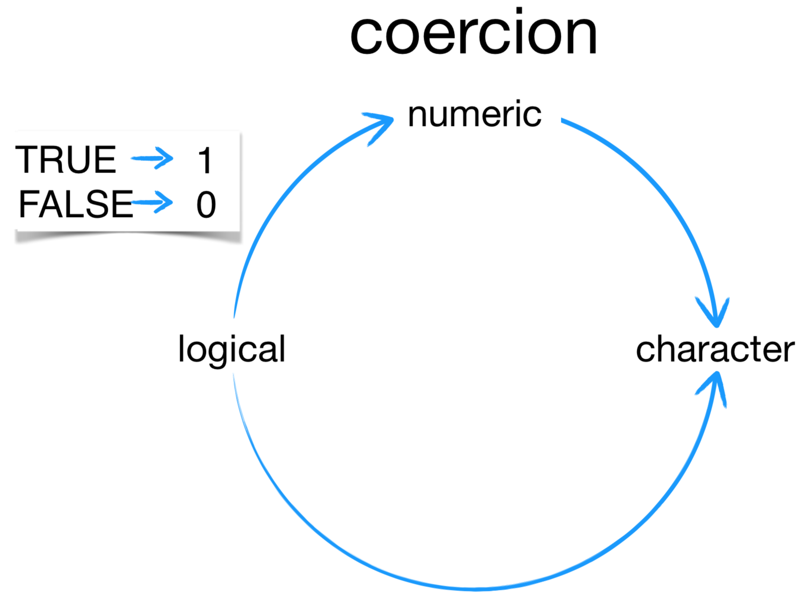

```{r setup, include=FALSE}
knitr::opts_chunk$set(echo = TRUE)
knitr::opts_chunk$set(dev='png', fig.align = 'center', fig.height = 4, fig.width = 6) 
#knitr::opts_chunk$set(class.source='fold-show')
library(tidyverse)

```


## Lesson Outcomes  
 - How can I read data in R?
 - What are the basic data types in R?
 - How do I represent categorical information in R?
 - How do I create new data files?  
 
## Best practices in naming objects  
From the R Style Guide:  

> Variable and function names should be lowercase. Use an underscore (_) to separate words within a name. Generally, variable names should be nouns and function names should be verbs. Strive for names that are concise and meaningful (this is not easy!).  
 
## Data in R  
R is designed to work with data, so it is very flexible in this regard. There are datasets built into certain packages. These are commonly used to test code and in demonstrations of different functions or workflows in R. You can read in your own data in a variety of formats. You can also create your own data in R and save it as a file in a variety of formats.  

### Built into R
To see what data is pre-loaded in R from the `datasets` package, use `data()`. *Note: because there is a function named data, it is not recommended to use data as a variable name.* 
```{r}
data()
my_data <- mtcars
head(my_data) # head shows first 6 rows of data by default
head(my_data, 10) # now will show 10 rows
tail(my_data) # tail shows last 6 rows of data

```

Other packages may also have interesting data sets. To see what data is available on your computer (i.e., from the installed packages), use the code below. *Note: you may need to load a package to access its data sets, if it is not loaded in your current R session.*  
```{r}
data(package = .packages(all.available = TRUE))

# let's use the very popular diamonds data set from gglplot2
my_next_data <- diamonds 
head(my_next_data)

```

---

### YOUR TURN EXERCISE  
Using the code examples and information above,  
1. Select a dataset from those in the `datasets` package.  
2. Print the first or last 3 rows.  
\newline
```{r, include = FALSE}
# your turn!


```


---


### Read in Data Files
Built in data can be very useful when testing or learning R. However, we will want to apply our skills to our own data sets. R is very flexible and can read in data from many types of files. One of the most common type of data file is one with comma separated values, a .csv file. There are base R functions to read in files and also functions in different packages, including those in the `tidyverse`.  

Let's see how to read in a .csv file. In the Data_Files folder, you should see a data set created from NHANES data: NHANES_FeMarkers_3to5y.csv. We'll read this file into our R environment and inspect it with a very helpful function, `summary()`.  
```{r}
nhanes_fe <- read.csv("data/NHANES_FeMarkers_3to5y.csv")
summary(nhanes_fe)
```

Take a look at the summary for this data set. What variables do you see? How many rows and columns are in the data set? Does everything look ok? Don't worry, you'll learn how to fix these problems in a later session. We'll also go over the `tidyverse` `readr` package and its suite of functions for reading in data.  

In the next sections you'll learn how to create your own data in R, using different data structures and types.  

## Data Structures and Types
 
### Vectors
Vectors combine multiple elements of the **same data type** (e.g., numeric, character) into a one-dimensional array. One way to create a vector is by using the function, `c()` (for concatenate). You have already worked with a vector in the Intro section. We created a vector of 10 random numbers using `rnorm()`.  

Let's create a vector of numbers using `c()`.  
```{r}
my_numbers <- c(5, 10, 15)
my_numbers
```

We can do math with vectors.  
```{r}
my_numbers + 3
my_numbers*2
my_numbers*my_numbers
```

We can find the length of the vector using `length()`. This is sometimes useful when counting or aggregating data.  
```{r}
length(my_numbers)
```

---

### YOUR TURN EXERCISE  
Using the code examples and information above,  
1. Create a vector of at least 3 words.  
2. Have R return the length of your vector.  

```{r, include = FALSE}
# your turn!
# hint: remember to use "" for text/character objects


```


---

### Types of Data
Above, we referred to vectors holding only one type of data. There are several types of data in R: numeric, integer, character, factor, logical, complex, and dates or date-times. It is important that you appreciate their differences and know how to convert between data types when necessary.  

```{r, echo=FALSE}
types <- c("numeric", "integer", "character", "factor", "logical", "complex", "date-time")
examples <- c("-0.2, 1, 56.890", "1, 34, 100", "'Hello there', 'Yes', '1', 'TRUE'", "'Yes', 'No', '1', '2'", "TRUE, FALSE", "1+3i, 0+1i", "2017-09-01, 07/04/1980, 2013-07-24 23:55:26")
uses <- c("math", "math", "notes, text, names", "categorization", "logic statements", "complex math", "dates and times")
types_tbl <- data.frame(types, examples, uses)
knitr::kable(types_tbl, col.names = c("Data Type", "Examples", "Uses")) 
```
  

### Coercion  
When R encounters a mix of types (here numeric and character) to be combined into a single vector, it will force them all to be the same type. *Note: columns in dataframes are vectors, so this concept of coercion will become very important as you analyze real world, messy data!*  

The coercion rules go:  
> logical -> integer -> numeric -> character, where -> can be read as 'are transformed into'.  

*Figure from Introduction to R & RStudio course by Amelia McNamara.*  
```{r, echo=FALSE, out.width="300px"}

```

Let's get a feel for how this works. We'll create vectors with mixed data elements and check their class to understand the concept of coercion in R.

---

### YOUR TURN EXERCISE  
Using the code examples and information above,  
1. Create a vector that contains the number 6, the word 'times', and the logical TRUE.  
2. Predict the class of your vector.  
2. Use `class()` to find out the class for your vector.  

```{r, include = FALSE}
# your turn!


```

  
---
  
Here is a real world example that may be encountered with lab test values, like HbA1c. Let's say we have a series of values from a patient and we want to find their average value.  
```{r}
HbA1c <- c(">14", 8.7, 5, 6.3, 7.1, "Test Cancelled") # create our vector of values
mean(HbA1c, na.rm = TRUE) # calculate the mean of the numeric values
class(HbA1c)

```

What happened in these cases?  

This could be very problematic in cases like this, where wanted to do math on the HbA1c values, or plot them.  

We can see from the figure that logicals can be coerced to numerics. What do you think will happen if we add TRUE and 5? Try it below.  
```{r}
TRUE + 5

```
What happened?  

We cover this to help you understand R's behavior when dealing with different data types. It is important to realize this and to pay attention to data classes as you progress in an analysis. Otherwise, you may have unexpected behavior that could seriously compromise your analyses!  
  
  
The as. functions help manually set the class:   
```{r, echo=FALSE}
functions <- c("as.numeric()", "as.character()", "as.factor()", "as.logical()", "as.Date()")
coerce_to <- c("numeric", "character", "factor", "logical", "date")
as_func_tbl <- data.frame(functions, coerce_to)
knitr::kable(as_func_tbl, col.names = c("Function", "Coerces to")) 
```

In a future section, we will go over a very useful package for formatting and using dates and date-time data, called `lubridate`.  

Let's figure out how we can handle those HbA1c values so we could find the mean.  

```{r}
HbA1c_num <- as.numeric(HbA1c) #did you get a warning? 
class(HbA1c_num) 
HbA1c_num
mean(HbA1c_num, na.rm = TRUE) 
#more on NAs later, but we're omitting them from the calculation here

```

When we coerce a data type to one that is not consistent, we introduce NAs. We typically get a warning that this has happened: *NAs introduced by coercion*. In a later session, you will learn more about NAs and how to handle them. In this case, we had to remove them from the calculation to obtain the mean value for the numerics. We did this by setting the `na.rm` argument to TRUE.  

### Lists
Lists are generic vectors that contain elements of different data types and even other lists. We create lists using `list()`. Lists are a very convenient data structure. In future sessions, we'll see that they are commonly used to hold the results of statistical functions. 

```{r}
my_list <- list('letters', 1, 2, 3, TRUE, list("more letters", 4, 5, FALSE))
my_list 
# gives a clue of how items in a list are indexed
# useful for when we want to retrieve them individually
```

It is even more useful if we provide names to the different components of our list. This helps us retrieve things as needed, since we can locate them by their index number or name in the list.  
```{r}
my_list_named <- list(word = 'letters', 
                      numbers = list(1, 2, 3), 
                      logical = TRUE, 
                      a_list = list("more letters", 4, 5, FALSE))
my_list_named 

```


Sometimes a function in R will return output in a list and this is not convenient for downstream use of the output. We can unlist items with `unlist()`. We'll see how this can be useful when we talk about the functions for manipulating text data types in R.  

---

### YOUR TURN EXERCISE  
Using the code examples and information above,  
1. Create a list, my_faves, with the following objects:  
a. Your first name.  
b. Your favorite color.  
c. Your favorite number.  
d. TRUE/FALSE: This is fun.  

Stretch: include names for your components: Name, Color, Number, Fun.  

```{r, include = FALSE}
# your turn!


```


---

List outputs are frequently encountered when using statistical methods in R. This includes linear modeling. We'll illustrate this with an example.  

```{r}
# you don't need to understand this code right now, we're more focused on it's output

# create OLS linear regression model for ferritin and iron values from the NHANES iron marker data set
reg <- lm(Ft_ngdL ~ Fe_ugdL, data = nhanes_fe)
summary(reg) 

#look at our new variable, reg -- it is a list with 12 elements
# we can pull out the intercept and slope and the fitted values and the residuals, etc. - these are within the different named elements of the list

# if we want to inspect the coefficients for the linear equation
reg$coefficients

# we can even get more specific and pull out the intercept and the slope to use them in math operations or other things
reg$coefficients[1] #gets the intercept
reg$coefficients[2] #gets the slope

# We'll cover more on how to subset and select out specific elements or parts of data in the next session 

```


### Data Frames (or Tibbles)  
The other type of commonly used data structure is a data frame. In the `tidyverse` packages, there is a special type of data frame called a tibble. We'll cover tibbles in the section on Working with Data. A data frame is a two dimensional group of R objects, organized into rows and columns. Data frames are tabular structures very similar to spreadsheet tables. Each column of the data frame is a vector, but each row is a data frame. Each column can contain a different type of data, but the type of data in a given column must be the same. Since rows are observations of different variables, they may contain different data types. We create data frames using `data.frame()`.  

You should also know that R has another type of data structure called a matrix. Matrices are tabular formats, like data frames, but they only contain ONE type of value -- so all numeric or all characters. We typically use matrices when we want to perform some type of mathematical operation. Given the nature of your work, you will most often work with data frames, but may come across correlation matrices and tuning matrices, as two commonly used matrices in R.  

```{r}
# can name the columns
my_df <- data.frame(numbers = c(1, 2, 3, 4), 
                    letters = c("A","B","C", "D"), 
                    logics = c(FALSE, TRUE, FALSE, FALSE)) 
my_df
```

It is useful at times to know things about a data frame. We can find out the column names using `names()`. We can learn the dimensions using `dim()`, the number of rows using `nrow()`, and the number of columns using `ncol()`. In the next section you will learn more about manipulating and working with data frames.  

```{r}
names(my_df)
dim(my_df)
nrow(my_df)
ncol(my_df)
```

---

### YOUR TURN EXERCISE  
Using the code examples and information above,  
1. Create a data frame, our_faves, that combines the favorite data above from yourself and 2 neighbors.  
a. Each of the 3 rows represents a person's data.  
b. There should be 4 columns: Name, Color, Number, Fun.  
2. View your data frame.  


```{r, include = FALSE}
# your turn!


```


---

### Saving Data to File
If you create your own data, or make changes to data, you may want to save your new file. We use R's set of 'write' functions for this.  

Let's save the data frame we created, `our_faves` as a .csv file. We need to tell R which object to write, where to put the file, and what to name it.  
```{r}
dir.create("data/results") #remember from previous session - use to create a new folder
write.csv(our_faves, "data/results/learnR_data.csv")
```

Check the Results folder. Is your new file there? Does it contain the expected data? You'll see this again in later sections.    

