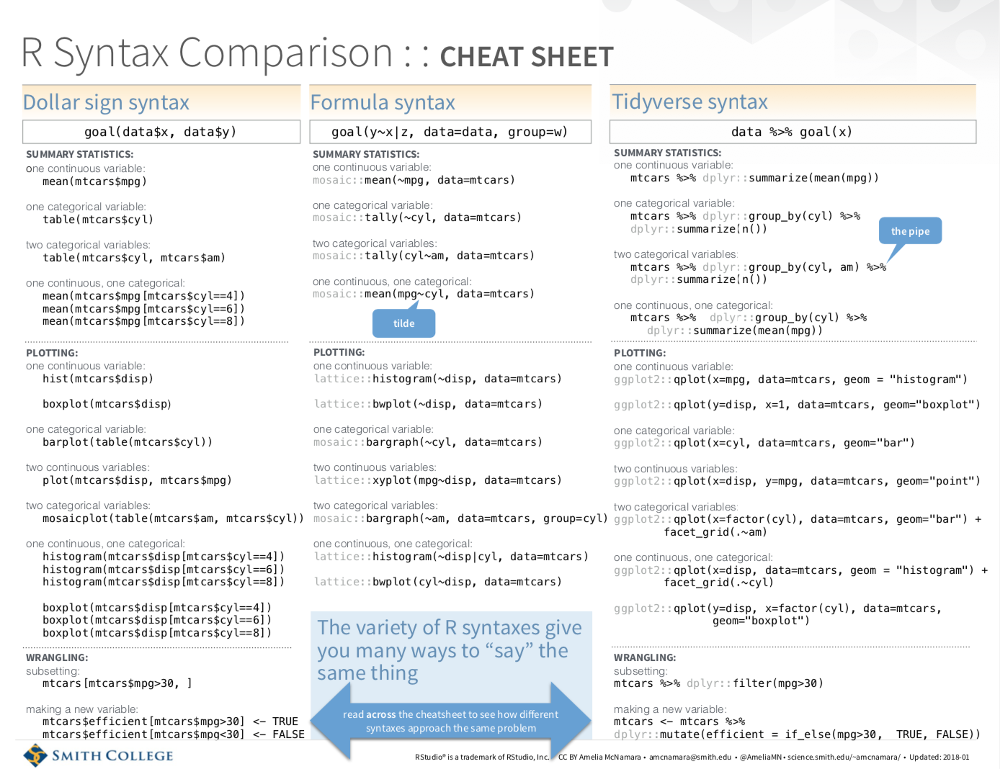
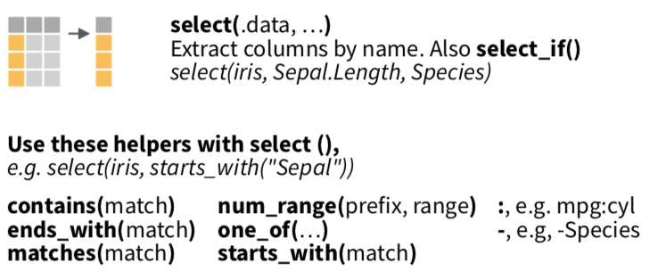
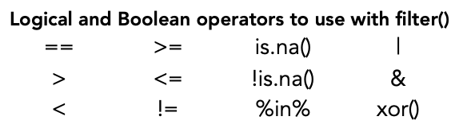

```{r setup, include=FALSE}
knitr::opts_chunk$set(echo = TRUE)
library(tidyverse)

```


## Lesson Outcomes
 - Change the format of data.
 - Manipulate data and data frames.
 - Subset data using base `R` syntax and `tidyverse` functions.
 - Create quick summaries of data.
 - Discuss how to handle missing data or NA values.
 - Apply special functions to work with dates.
 - Apply special functions to work with text data.
 - Apply special functions to work with categorical data.
 

## Syntax
One of the best and worst things about R is its flexibility, particularly related to syntax. Syntax is the structure and rules of a programming language that determine whether or not code will work. There are many valid syntaxes in use in R. We've covered some of the syntax of base R. Now you'll also learn about a newer philosophy called the `tidyverse`.  

According to the official website, www.tidyverse.org:
> The tidyverse is an opinionated collection of R packages designed for data science. All packages share an underlying design philosophy, grammar, and data structures.  

If you install the `tidyverse`, you install the following packages:  
```{r, echo=FALSE, out.width="300px"}

```


Not all R packages are compliant with the `tidyverse` so it's useful to understand how to do the same things in base R and in the `tidy` way. Here we will gain an introduction to using both base R and `tidyverse` packages to work with data sets.    

Dr. Amelia McNamara created a handy cheat sheet to compare the different types of syntax in R. We have placed a copy of this cheat sheet in the docs folder. The first page is shown below.    

```{r, echo=FALSE}

```

## Getting to know your Data  
As you know, one of the first things to do with a new data set is explore it and figure out what you have and what you need to do so it is prepared for visualization and analysis.  

First, we need to read in a data set. Let's use that NHANES data again. Do you remember what function we used to read in a .csv file? Now, you'll learn how to read in a .csv file using the `readr` package (of the `tidyverse`): `read_csv()`.  

```{r}
nhanes_data <- read_csv("data/NHANES_FeMarkers_messy.csv")
```

There are handy functions, including `glimpse()` and `summary()`, which give us quick insight to our data set. Let's see how those work on the NHANES data.  

```{r}
glimpse(nhanes_data)
# see number of rows and columns, column names and data type - do all make sense?
```

```{r}
summary(nhanes_data)
# statistical summary of each column - do all make sense?
```

The `read_csv()` function takes a guess about data type for each column. Sometimes it gets it correct, other times, you will need to intervene. In our case, it has wrongly assigned the Gender and Race_ethn columns as numeric. These are coded factor variables. We may also want to change Age to integer class, as this is the way the data was collected. The Subject may be considered as a factor versus a number. There are character columns that may be better as factors. In a later section, you will learn how to work with date-time fields. We also see that the nhanes_data_clean column is a character for some reason, whereas all other lab data columns are correctly assigned as numeric. For now, we'll leave things as is, but will come back to this in sections below to do the necessary clean up.  

---
### Remember the concept of coercion

We need to revisit a few key concepts from the last session. Recall that columns in dataframes are vectors, so they can only contain a single type of data. To achieve this, R may need to coerce elements of a vector into a single data type. The results may not be consistent with our intent. Additionally, if there is no available type, we may introduce NAs by coercion. We typically get a warning that this has happened and we will need to decide how to deal with the NAs.

These are things to keep in mind as we learn how to subset and clean up our data to prepare it for analysis or visualization.  
 
---

## base R for subsetting data

Base R has three subsetting operators to refer to and then select elements, rows, or columns of data sets: [[ ]], [ ], and $. These operators interact differently with different types of data structures.  

```{r}
# USED ON A VECTOR:
racer <- c("Mario", "Princess Peach", "Wario", "Baby Luigi")
racer[2] # selects 2nd element
racer[4]
racer[3:4] # selects elements 3 and 4

racer[[2]] # same behavior as [ ] for a vector, but this changes for lists

# USED ON A LIST:
mk8_list <- list(racer = c("Mario", "Princess Peach", 
                           "Wario", "Baby Luigi"),
                 wt = c("middle", "middle", "heavy", "light"),
                 speed = c(3.75, 3.25, 4.75, 2.25))
one <- mk8_list[1] # returns a list of the first item of the list
one

unnamed_list <- list("a", "b", "c", "d")
unnamed_list[[1]]

mk8_list[2:3] # returns a list of the 2nd and 3rd items in the list

two <- mk8_list[[1]] # returns a vector with the elements of the first item of the list
two

two_alt <- mk8_list$racer # same as two

# notice the difference between one and two in the environment, but that two and two_alt are equivalent

mk8_list$place <- c("second", "third", "fourth", "first") # adds new element to the list
mk8_list

# USED ON A DATAFRAME
# remember a dataframe is a special type of list where all elements are the same length.
mk8_df <- data.frame(racer = c("Mario", "Princess Peach", 
                               "Wario", "Baby Luigi"),
                     wt = c("middle", "middle", "heavy", "light"),
                     speed = c(3.75, 3.25, 4.75, 2.25))
# [row, column]
mk8_df[1,1] # returns element in first row, first column [row, column]
mk8_df[ ,2] # returns elements in all rows for the second column
mk8_df$wt # also returns elements in all rows for second column by name
mk8_df[2, ] # returns second row for all columns

mk8_df[[1,2]] # returns element of 1st row, 2nd column
mk8_df[[2]] # returns elements of 2nd column

mk8_df$place <- c("second", "third", "fourth", "first") # adds new column called place
mk8_df 
```

You will have a chance to practice this in the exercises for this session. Let's look at how we can do similar operations using the `tidyverse` packages.  

---

## `dplyr` for manipulating cases

The package of the `tidyverse` that is used for manipulating data is `dplyr`. This package has several useful functions to subset data based on rows and columns, to arrange and group data, and to summarize it.  

### Modifying Columns  
To create new columns or modify existing columns, we use `mutate()`. In our current example, we will need to mutate the Gender and Race_ethn columns to change the data type to factors using `factor()` or `as.factor()`.   

  
```{r}
nhanes_data_clean <- mutate(nhanes_data, 
                             Gender = factor(Gender), 
                             Race_ethn = factor(Race_ethn))
#we can change more than one column in a single mutate() call

glimpse(nhanes_data_clean) #fct = factor!
summary(nhanes_data_clean) #look what the summary does now for factors
```


### Selecting, Filtering, Arranging  
It is common practice to sort data based on values in one or more columns and you may also want to work with select rows or columns. There are specific functions for this in `dplyr`.  

#### Select Columns
The `select()` function allows us to subset data into a new table by column name. Let's create a subset that includes only the non-lab variables.  

```{r}
nhanes_data_demo <- select(nhanes_data_clean,
                           Subject, Gender, Age_months, Race_ethn) 
#see the new object in your environment?
```

What if we decide that we don't need the Race_ethn column in our subset?
```{r}
nhanes_data_demo <- select(nhanes_data_demo, -Race_ethn) 
#see the change in your environment? can also use -c() to remove several columns

nhanes_data_demo <- select(nhanes_data_demo, -c(Age_months, Gender))

nhanes_fe <- select(nhanes_data_clean, Ft_ngdL:TfSat_pct)
```

There are a number of 'helpers' we can use for `select()` to make it even more powerful:  
```{r, echo=FALSE}

```

*Note, this syntax still works, but has been superseded by the use of `across()`.*  

---

### YOUR TURN EXERCISE  
Using the code examples and information above,  
1. Create a subset of the cleaned NHANES data that includes Subject and 2 of the lab value columns.  
2. View your new table and check that your code worked as expected.  

```{r}
# your turn!
nhanes_data_clean_lucy <- select(nhanes_data_clean, 
                                 Subject, Fe_ugdL, MCV_fL)


```


```{r, include = FALSE}
## A SOLUTION
nhanes_clean_subset <- select(nhanes_data_clean, Subject, Fe_ugdL, Ft_ngdL)


```

---

#### Filter Rows
We also often have a need to filter rows, either to select them for a subset, or to remove them from particular analyses. The `filter()` function returns a subset of rows as a new table. This function works with a set of logic and boolean operators:  
```{r, echo=FALSE}

```

Let's create a subset of male subjects (Gender = 1) from our NHANES data set.
```{r}
nhanes_males <- filter(nhanes_data_clean, Gender == 1) 
#does the number of rows match our summary for number of Gender = 1?
```


What about if we want males who are 4 years old (i.e., 48 - 60 months old)?
```{r}
nhanes_4y_males <- filter(nhanes_data_clean, 
                          Age_months >= 48 & Age_months < 60, 
                          Gender == 1)

nhanes_4y_or <- filter(nhanes_data_clean, 
                          Age_months >= 48 & Age_months < 60 | 
                          Gender == 1)

```

The `%in%` operator can make selections very efficient, particularly when you have a series of 'or' statements. Let's filter the male 4 year old NHANES data subset for only Race_ethn classes 1 or 2 or 3.  

```{r}
nhanes_4y_males_racesubset <- 
  filter(nhanes_4y_males, Race_ethn %in% c("1", "2", "3"))

races <- c("4", "5")

filter(nhanes_4y_males, Race_ethn %in% races)
```

Sometimes it's more convenient to describe what you do NOT want. We can do this with the `!` in our expressions. The syntax is more straightforward for 'not equal to' than for 'not within' statements.  

```{r}
nhanes_4y_not_males <- filter(nhanes_data_clean, 
                          Age_months >= 48 & Age_months < 60, 
                          Gender != 1) #does not equal 1

# to use with %in% have to negate entire statement
nhanes_4y_not_males_not_racesubset <- 
  filter(nhanes_4y_not_males, !(Race_ethn %in% c("1", "2", "3")))
```

---

### YOUR TURN EXERCISE  
Using the code examples and information above,  
1. Create a subset of the cleaned NHANES data that are female subjects who belong to Race_ethn class 3.  
2. View your new table and check that your code worked as expected.  

```{r}
# your turn!
nhanes_data_clean_girls_race <- filter(nhanes_data_clean,
                                       Race_ethn == 3,
                                       Gender == 2)


```

```{r, include = FALSE}
## A SOLUTION
nhanes_3_females <- filter(nhanes_data_clean, Gender == "2", Race_ethn == "3")

```

---

#### Arranging Data
Sorting data is something we do commonly, both to inspect data or to present it in a specific way. The `arrange()` function sorts data based on values in a specified column or columns. The default is ascending order. We can arrange in descending order by using `desc()` within the `arrange()` call.    

Let's arrange our NHANES data based on age. First in ascending order and then in descending order.  
```{r}
nhanes_sorted <- arrange(nhanes_data_clean, Age_months)
head(nhanes_sorted)

nhanes_sorted_desc <- arrange(nhanes_data_clean, desc(Age_months))
head(nhanes_sorted_desc)
```

---

### YOUR TURN EXERCISE  
Using the code examples and information above,  
1. Arrange your female data subset from above in descending order by Fe concentration.  
2. View your new table and check that your code worked as expected.  

```{r}
# your turn!
head(arrange(nhanes_data_clean_girls_race, desc(Fe_ugdL)))

head(arrange(nhanes_data_clean_girls_race, Age_months, desc(Fe_ugdL)))


```


```{r, include = FALSE}
## A SOLUTION
nhanes_3_females_sort <- arrange(nhanes_3_females, desc(Fe_ugdL))

```

---

#### Data Flow with the Pipe Operator
There is a special operator that can be used in the `tidyverse`, called the pipe: `%>%`. This allows us to flow data from one step to the next. The pipe operator passes the result on left into first argument of function on right. In the examples above, we have been writing the data object as the first argument in each of the functions. The `%>%` becomes very useful when we want to string together a series of data preparation steps.  

Let's combine some of the steps we've done above into a single chunk using the pipe operator. *Note: it's good practice for the `%>%` to be at the end of the code line*  

For a new object, nhanes_pipe_test:  
1. From nhanes_data_clean, create a new column called calc_TfSat, which is (Fe / TIBC) * 100. Round these values to one decimal place.  
2. Subset the resulting data for females.  
3. Subset the resulting data for Subject, calc_TfSat, and TfSat_pct.  
4. Arrange the resulting data by ascending calc_TfSat.  

```{r}
nhanes_pipe_test <- 
  nhanes_data_clean %>%
    mutate(calc_TfSat = round((100*Fe_ugdL/TIBC_ugdL),1)) %>%
    filter(Gender == 2) %>%
    select(Subject, calc_TfSat, TfSat_pct) %>%
    arrange(calc_TfSat)

head(nhanes_pipe_test)
```
Are you able to follow the code and get the expected result? Are there alternate ways we could have arrived at the same subset? The reproducibility and transparency of this code should be obvious at this point!    

Now, let's practice using the `%>%`!

---

### YOUR TURN EXERCISE  
Using the code examples and information above,  
For a new object, im_piping_hot,    
1. From nhanes_data_clean, create a new column called Analyst, which is your first name.  
2. Subset the resulting data for Subject, Fe_ugdL, Age_months, Analyst.  
3. Arrange the resulting data by ascending Fe_ugdL. 

```{r}
# your turn!
im_piping_hot <- nhanes_data_clean %>%
                  mutate(Analyst = "Shannon") %>%
                  select(Subject, Fe_ugdL, Age_months, Analyst) %>%
                  arrange(Fe_ugdL)
                  

```


```{r, include = FALSE}
## A SOLUTION
im_piping_hot <- 
  nhanes_data_clean %>%
    mutate(Analyst = "Shannon") %>%
    select(Subject, Fe_ugdL, Age_months, Analyst) %>%
    arrange(Fe_ugdL)
      

```

---

### Grouping and Summarizing Data
R's `dplyr` makes creating tables of summary data easy with `summarize()`. We can take this further and analyze data by groups using `group_by()`.  

Let's summarize our NHANES data set by finding the mean, min, and max values for Ferritin (Ft_ngdL). We can also get a tally of the number of cases.  

```{r}
nhanes_data_clean %>% 
  summarize(mean_Ft = mean(Ft_ngdL), 
            max_Ft = max(Ft_ngdL), 
            min_Ft = min(Ft_ngdL),
            n = n())
```

We can see if there are differences by Gender if we use `group_by()`:  
```{r}
nhanes_data_clean %>% 
  group_by(Gender) %>%
  summarize(mean_Ft = mean(Ft_ngdL), 
            max_Ft = max(Ft_ngdL), 
            min_Ft = min(Ft_ngdL),
            n = n())
```

We can split this further to observe differences between Gender for a given Race_ethn category:  
```{r}
nhanes_data_clean %>% 
  group_by(Race_ethn, Gender) %>%
  summarize(mean_Ft = mean(Ft_ngdL), 
            max_Ft = max(Ft_ngdL), 
            min_Ft = min(Ft_ngdL),
            n = n())


```

---

### YOUR TURN EXERCISE  
Using the code examples and information above,  
Modify the code from above to more directly compare Race_ethn within a Gender (i.e., group by Gender then by Race_ethn)  

```{r}
# your turn!
# modify this code
nhanes_data_clean %>% 
  group_by(Gender, Race_ethn) %>%
  summarize(mean_Ft = mean(Ft_ngdL), 
            max_Ft = max(Ft_ngdL), 
            min_Ft = min(Ft_ngdL),
            n = n())


```


```{r, include = FALSE}
## A SOLUTION
nhanes_data_clean %>% 
  group_by(Gender, Race_ethn) %>%
  summarize(mean_Ft = mean(Ft_ngdL), 
            max_Ft = max(Ft_ngdL), 
            min_Ft = min(Ft_ngdL),
            n = n())

```

---

We can easily create a summary of the mean and median for each lab value using `summarize_if()`:  
```{r}
nhanes_data_clean %>% 
  group_by(Gender) %>%
  select(-Subject, -Age_months, -Resulted_t) %>% #remove other numeric columns
  summarize_if(is.numeric, list(mean = mean, med = median))
```

A new column is created for each variable with the function name appended to the column name.  

---

### YOUR TURN EXERCISE  
Using the code examples and information above,  
1. Calculate the mean and standard deviation of Tf saturation values by Race_ethn class.  
2. Name the summarized columns in a meaningful way.  
2. Include a column that shows the number of subjects in each category.  

```{r}
# your turn!
nhanes_data_clean %>%
  group_by(Race_ethn) %>%
  summarize(mean_TfSat = round(mean(TfSat_pct), 2), 
            sd_TfSat = round(sd(TfSat_pct),2),
            n_TfSat = n()) %>%
  arrange(desc(n_TfSat))

nhanes_data_clean %>%
  group_by(Race_ethn) %>%
  summarize(mean = mean(TfSat_pct), sd = sd(TfSat_pct)) 


```


```{r, include = FALSE}
## A SOLUTION
nhanes_data_clean %>%
  group_by(Race_ethn) %>%
  summarize(mean_Tfsat = mean(TfSat_pct),
            sd_Tfsat = sd(TfSat_pct),
            n = n())

```

---

#### Handling NA values  
The column for MCV_fL was not included in our summary above because it is not numeric, although it should be. For some reason, the column was read in as a character data type. This suggests there was a non-numeric included in the MCV_fL column values. We can start investigating by converting the column to numeric.  

```{r}
nhanes_data_clean <- nhanes_data_clean %>%
                      mutate(MCV_fL = as.numeric(MCV_fL)) # did you see the warning? NAs introduced by coercion
```

R has special functions for finding and handling NA values. You should understand where the NAs are coming from in your data, as the resolution depends on the scenario and impact to downstream analyses and visualizations.  

```{r}
head(is.na(nhanes_data_clean$MCV_fL)) # provides a logical of if every observation is NA or not. 

# count how many NAs are in a data set
sum(is.na(nhanes_data_clean$MCV_fL)) # works because TRUE = 1

# we can combine the which function to find out which observation(s) contain NAs

which(is.na(nhanes_data_clean$MCV_fL)) # what is the output here?
nhanes_data_clean[63, "MCV_fL"] # here it is
```

So it looks like our entry for MCV_fL in row 63 was coerced to NA when we changed the character data to numeric. Let's take a closer look at that observation. We have to go back to the original data we read in, our nhanes_data object.  

```{r}
nhanes_data[63, "MCV_fL"] # quick way to identify the MCV_fL value in the 63rd row. What happened here???
```
  
OK so now that we know the source of the problem, what can we do? We could drop the row with the NA using `drop_na()`. This may be a reasonable approach in certain cases, but is not always a good idea. We can also replace the NA with either a standard value (e.g., 0 or "unknown") or a specific one. Our replacement can vary by column or row. In our case, it looks like the value should be 80, but was keyed in as 8o. We can manually replace the NA with the expected value of 80 using `replace_na()`.  

```{r}
nhanes_data_clean <- 
  nhanes_data_clean %>%
    replace_na(list(MCV_fL = 80))

nhanes_data_clean[63, "MCV_fL"] # check

```
  
Let's try that summarize of the numeric columns again:  

```{r}
nhanes_data_clean %>% 
  group_by(Gender) %>%
  select(-Subject, -Age_months, -Resulted_t) %>% #remove other numeric columns
  summarize_if(is.numeric, list(mean = mean, med = median)) #success!
```

---

## `lubridate` for working with dates and date-times  

Date and date-time data are commonplace in analytics and healthcare. Though they are very familiar to you, working with date-times can be tricky because of various formats and changing rules based on time zones, leap years, and daylight savings times, etc. The `lubridate` package was designed to help users work with date and date-time data. Often we want to work with that data in a more human-interpretable format. You will use `lubridate` functions to convert strings or numbers to date-times and to manipulate date-time data.  

Let's take a look at the `lubridate` cheatsheet to get a sense of what it does and the syntax.  


In our cleaned NHANES data set, we have two date-time columns, Collected_t and Resulted_t. Though both represent date-times, they are in different formats. If we inspect the class type of each column, what do we get?  

```{r}
glimpse(nhanes_data_clean)

#Collected_t == dttm aka, date-time
#Resulted_t == dbl aka, numeric
```

So, we need to modify the Resulted_t column to convert it from a numeric into the date-time. The numeric values in this columns represent a date-time in seconds since 1970-01-01 00:00:00 UTC. We will load the `lubridate` package and use its functions.  

```{r}
# may need to install lubridate first
#install.packages("lubridate")
library(lubridate)
nhanes_data_clean <- nhanes_data_clean %>%
  mutate(Time_finished = as_datetime(Resulted_t)) #create new column with date-time

glimpse(nhanes_data_clean) #see the difference in Resulted_t and Time_finished?
```

Now that both date-time columns are in the same (POSIXlt) format, we can do math on them.  Let's calculate the time between when the sample was collected and when testing was finished and save this as a new column, testing_TAT. There is a base R function, `difftime()`, which does this calculation for you.  

```{r}
nhanes_data_clean <- nhanes_data_clean %>%
                mutate(testing_TAT = difftime(Time_finished, 
                                              Collected_t, 
                                              units = "mins"))

class(nhanes_data_clean$testing_TAT) #notice this is not numeric
```

We can plot a distribution of the times it takes to complete the testing, using this new column. Note the output of `difftime()` is not numeric, it is of class difftime. To do some operations with difftime objects, you will need to convert the output to numeric, using `as.numeric()`.  

```{r}
ggplot(nhanes_data_clean, aes(x = testing_TAT)) +
  geom_histogram(binwidth = 10) # notice the warning

ggplot(nhanes_data_clean, aes(x = as.numeric(testing_TAT))) +
  geom_histogram(binwidth = 10) # no difftime object warning
```


Finally, we may want to visualize differences based on attributes of date-times. We can use `lubridate` functions to extract components of date-times, such as day, month, year, etc.  

Let's see if the numbers of lab orders change over the week. We can do this with a bar plot showing the number of orders collected each day of the week. The `wkday()` function allows us to get the day of the week for a given date-time. The default (via label = FALSE) is to represent the days as integers 1-7. We can change the `label` argument to TRUE to show the abbreviated name of the day of the week (i.e., Sunday, Monday, etc.). To show the full name, we set the `abbr` argument to FALSE.  

```{r}
# Do the numbers of samples collected change over the week?
ggplot(nhanes_data_clean, 
       aes(x = wday(Collected_t, label = TRUE))) +   
      geom_bar() +
      labs(x = "Day of Week", y = "Subjects Collected") # make labels more informative

```

The power of `lubridate` is that it helps you easily parse date-time data in character or numeric formats to Date or POSIXct objects. You read in your data, inspect the format of the date-time column, and select the right function to parse the dates.  

Let's look at some examples:  

```{r}
now <- "2020-10-26 08:24:05"
class(now) # character, want date

# use lubridate -- format is ymd hms, so select this parser function

now_dt <- ymd_hms(now)
class(now_dt)

then <- "01-05-2010 09:12"
then_dt <- mdy_hm(then, tz = "America/New_York")

when <- "5 Jan, 2010"
when_dt <- dmy(when)

also <- 010510 # as a number
also_dt <- mdy(also)
```

---

### YOUR TURN EXERCISE  
Using the cheatsheet with code examples and information above,  
1. Create a new column for nhanes_data_clean called, day_collected, that shows the day of the month the testing was collected. *Hint: Look for the accessor function that finds the day of the month.*   
2. Create a set of boxplots of the testing_TAT by day_collected. *Hint: You will need to make the day_collected column a factor variable, remember factor().*  
3. Change the x and y axis labels to be more informative.  

```{r}
# your turn!


```

```{r, include = FALSE}
## A SOLUTION
nhanes_data_clean <- nhanes_data_clean %>%
  mutate(day_collected = day(Collected_t))

ggplot(nhanes_data_clean, 
       aes(x = factor(day_collected), y = testing_TAT)) +
  geom_boxplot() +
  labs(x = "Day of Month Collected", y = "Testing TAT (min)")

```

---

## `stringr` for working with text data

We've talked before about the character data type that is for text. In programming, text data are referred to as strings. As with dates, there are special functions to work with strings in R. We will learn about the `tidyverse` package `stringr` that was designed for working with text or character data. This package is very powerful, we will only learn about a few key functions from it.  

Some common functions for working with text include, combining strings, splitting strings, and finding or replacing parts of strings.  

You may want to combine strings (and other data types) into a single string to programmatically title plots or when writing reports that include results from data analyses. You can do this with `str_c()`.  

```{r}
c("NU Pathology ", "Learn R!")
str_c("NU Pathology ", "Learn R!") #default sep = "" (no space)
#notice the difference

str_c("There are", nrow(nhanes_data), "cases in this data set.", sep = " ")


```

You may also want to split strings or extract only specific parts or create new variables from a single character variable. For example, let's look at the collection location in the NHANES data set. If we want to analyze data by location type or site, we could create new columns by separating the provided column. To split strings, we use `str_split()`. To extract parts of a string, we use `str_extract()`.   

```{r}
collect_loc <- c("LC-PICU", "LC-NICU", "LC-ER", "NM-ER", "NM-CICU")
str_split(collect_loc, "-") # what is the output here? list of character vectors
# if you want a vector output, have to use unlist()
str_split(collect_loc, "-") %>% unlist()

# can also get out a matrix, which may be better here
str_split(collect_loc, "-", simplify = TRUE) # what is the output here? character matrix


```

Let's put use this with mutate to create new columns for collect site and collect location type.  

```{r}
nhanes_data_clean <- 
  nhanes_data_clean %>%
      mutate(collect_site = 
               factor(str_split(Collected_loc, "-", 
                                simplify = TRUE)[ ,2]),
             collect_type = 
               factor(str_split(Collected_loc, "-", 
                                simplify = TRUE)[ ,1]))
                               
```

We may also want to replace parts of a string with specific text, based on a pattern. We can do this with `str_replace()`.  

```{r}
collect_loc <- c("LC-PICU", "LC-NICU", "LC-ER", "NM-ER", "NM-CICU")

str_replace(collect_loc, "LC", "Lurie") #wow!

```

We can get very fancy with this concept using syntax called regular expressions. The second page of the `stringr` cheat sheet shows commonly used regular expressions. Let's look at how this can be used with real-world, messy lab value data from point-of-care HbA1c tests. We can use `str_extract()` to pull out just the numbers from a vector of values with varying formats.  

```{r}
hba1c <- c("7.3", ">14.0", "6.4%+", "8.0%", ">14.0%", "9.0%+", "8.5%", "10.2", "9.0%", "9.5 %+", "8.9%", "11.2% +", "11.4", "13.2", ">14.0", "7.9%", "10.2%", "8.0", "5.3", "5.0", "8.7%+", "7.7%+", "7.0%+", "5.1", "7.3")

str_extract(hba1c, "[[:digit:]]+\\.*[[:digit:]]") # better, but not yet numeric

as.numeric(str_extract(hba1c, "[[:digit:]]+\\.*[[:digit:]]")) # yes!

```

A function similar to `str_extract()` is `str_sub()`, which extracts and replaces subsets of strings. This function is very useful for working with starts or ends of strings or other more straightforward regular expression patterns for subsetting strings. We could have created our collection site and type variables, using `str_sub()` as follows:  

```{r}
nhanes_data_clean <- 
  nhanes_data_clean %>%
      mutate(collect_type_sub = 
               factor(str_sub(Collected_loc, 1, 3)), # select 1st-3rd characters
             collect_site_sub = 
               factor(str_sub(Collected_loc, -1))) #select the last character
glimpse(nhanes_data_clean)
```


You can use `str_length()` to tell you how many characters are in your string. The `length()` function won't provide the answer; it tells you how many elements are in a vector. You want `str_length()`.  

```{r}
str_length("NU Pathology Learn R! Session 4") 
length("NU Pathology Learn R! Session 4")
```


---

### YOUR TURN EXERCISE  

Using the cheatsheet with code examples and information above to  

(1) Create a string vector of your first and last name and then write code to change your name vector to 

(a) all upper case, and then to 

(b) all lower case.  

(2) Create a new vector that contains only the first letter of your first name and the first 4 letters of your last name.  

```{r}
# your turn!


```

```{r, include = FALSE}
## A SOLUTION
# (1) going up and down in case
my_name <- "Shannon Haymond"
my_name_up <- str_to_upper(my_name)
my_name_low <- str_to_lower(my_name_up)

# (2) splitting and combining substrings
my_name_split <- unlist(str_split(my_name_low, " ")) #because str_split provides results as a list
my_name_sub <- str_c(str_sub(my_name_split[1], 1, 1), 
                    str_sub(my_name_split[2], 1, 4))


```

---

There are several other useful `stringr` functions you may want to look up:

- `str_pad()`, `str_trim()`
- `str_to_title()`, `str_to_sentence()`
- `str_order()`, `str_sort()`
- `str_detect()`, `str_which()`

---

## `forcats` for working with categorical (factor) data

We often encounter categorical or factor variables and these pose a unique set of problems. The `forcats` package includes a suite of tools to handle common problems with factor variables. These include reordering factors and changing the values of the categories (levels).  

You've already been exposed to `forcats` in the code above, as we changed character variables to factors using `factor()` (can also use `as_factor()`). Similar to the output from summary, we can inspect our categorical variables using `fct_count()` and `levels()`. Let's take a look at the Consented variable in the NHANES data set.  

```{r}
# convert Consented to a factor variable
nhanes_data_clean <-
  nhanes_data_clean %>%
  mutate(Consented = factor(Consented))

# determine the levels and count for each
levels(nhanes_data_clean$Consented) 

fct_count(nhanes_data_clean$Consented)

```

Looks like we have inconsistent entries for the same value in our Consented column. We can recode these levels to make them consistent using `fct_recode()` or `fct_collapse()`.  

```{r}

nhanes_data_clean <-
  nhanes_data_clean %>%
  mutate(Consented = fct_collapse(Consented, "Y" = c("Yes", "YES")))

fct_count(nhanes_data_clean$Consented) # success!

```

We often need to recode or rename categories to make them more clear on visualizations or data summaries. We can do this using `fct_recode()`. Let's see how this can transform the Race_ethn variable of the NHANES data set.   

```{r}
# notice recode syntax is new name = old name
nhanes_data_clean <- nhanes_data_clean %>%
              mutate(Race_ethn = fct_recode(Race_ethn, 
                                        "Mexican American" = '1', 
                                        "Other Hispanic" = '2',
                                        "Non-Hispanic White" = '3',
                                        "Non-Hispanic Black" = '4',
                                        "Other Race - Including Multi-Racial" = '5'))
```

We may want to reorder the categories based on their relative frequencies using `fct_infreq()`. We can also reorder by alphabetical, based on another variable, or some other manually established order using `fct_reorder()`. Reordering factor levels often helps when plotting or summarizing results.  

```{r}
ggplot(nhanes_data_clean, aes(x = fct_infreq(Race_ethn))) +
  geom_bar(aes(fill = Gender), position = "dodge") +
  labs(x = "") + 
  theme_bw() + 
  theme(axis.text.x = element_text(angle = 90, 
                                   hjust = 1, vjust = 0.5))
```
  
As we discussed in the visualization session, we can improve this plot by flipping the coordinate system. However, this is going to reverse the order of our factor categories as well. We'll need to reverse the order of the ordered factors using `fct_rev()` to have things line up as we'd like.  


```{r}
ggplot(nhanes_data_clean, aes(x = fct_rev(fct_infreq(Race_ethn)))) +
  geom_bar(aes(fill = Gender), position = "dodge") +
  labs(x = "") + 
  theme_bw() + 
  coord_flip()
```

What if we want to reorder the Race_ethn variable by the mean age for each group - we can use `fct_reorder()` for this.  

```{r}
nhanes_age_summary <- nhanes_data_clean %>%
  group_by(Race_ethn) %>%
  summarize(mean_age_months = mean(Age_months, na.rm = TRUE),
            n = n())

ggplot(nhanes_age_summary, 
       aes(mean_age_months, 
           Race_ethn)) +
  geom_point()
```

Reordering by the mean age in months will make the results more clear, though you want to make sure you are only reordering categories where the order is otherwise arbitrary. (Meaning, be careful if reordering levels that have an inherent order.)   

```{r}
# now reorder Race_ethn by the mean age
ggplot(nhanes_age_summary, 
       aes(mean_age_months, 
           fct_reorder(Race_ethn, mean_age_months))) +
  geom_point()
```


---

### YOUR TURN EXERCISE  


Using the cheatsheet with code examples and information above to  

(1) Count the number of cases in each Race_ethn category for the nhanes_data_clean object.  

(2) Modify the Gender column of the nhanes_data_clean object to recode the category levels of 1 and 2 to Male and Female, respectively.  


```{r}
# your turn!


```

```{r, include = FALSE}
## A SOLUTION

fct_count(nhanes_data_clean$Race_ethn)

nhanes_data_clean <- nhanes_data_clean %>%
                      mutate(Gender = recode(Gender, 
                        "Male" = '1', "Female" = '2'))

```

---
